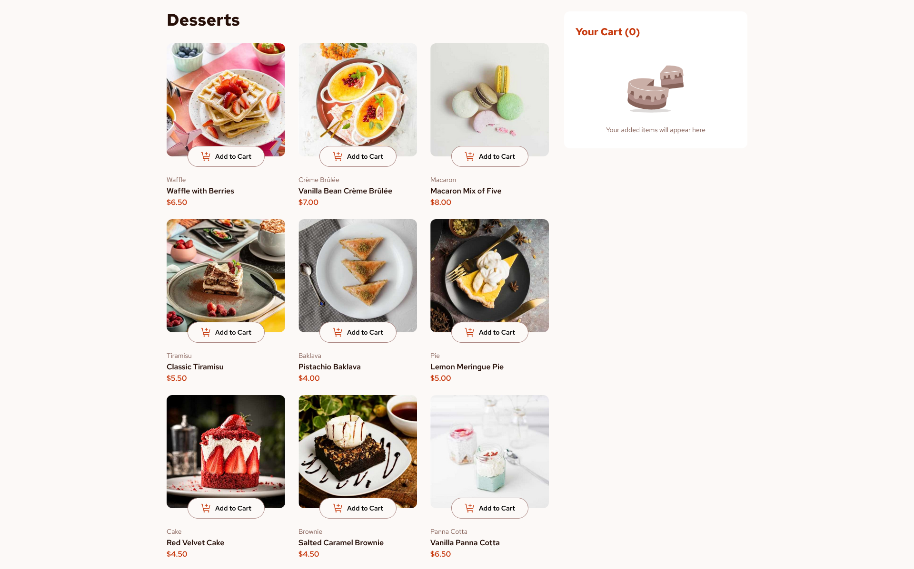

# Frontend Mentor - Product list with cart solution

This is a solution to the [Product list with cart challenge on Frontend Mentor](https://www.frontendmentor.io/challenges/product-list-with-cart-5MmqLVAp_d). Frontend Mentor challenges help you improve your coding skills by building realistic projects.

## Table of contents

- [Overview](#overview)
  - [The challenge](#the-challenge)
  - [Screenshot](#screenshot)
  - [Links](#links)
- [My process](#my-process)
  - [Built with](#built-with)
  - [What I learned](#what-i-learned)
  - [Continued development](#continued-development)
  - [Useful resources](#useful-resources)
- [Author](#author)

## Overview

### The challenge

Users should be able to:

- Add items to the cart and remove them
- Increase/decrease the number of items in the cart
- See an order confirmation modal when they click "Confirm Order"
- Reset their selections when they click "Start New Order"
- View the optimal layout for the interface depending on their device's screen size
- See hover and focus states for all interactive elements on the page

### Screenshot

### Links

- Live Site URL: [Add live site URL here](https://your-live-site-url.com)

## My process

### Built with

- Semantic HTML5 markup
- CSS/SCSS
- SCSS variables/mixins/modules
- Flexbox
- Grid
- Mobile-first workflow
- [React](https://reactjs.org/) - JS library

### What I learned

This project was a good exercise for practicing many of the React concepts I've learned so far, including managing State, Reducers, Refs, Contexts and Effects.

### Continued development

So far I'm still learning the basics about React, so I'm looking forward to adding more knowledge in order to be able to use this library in a more efficient and readable way.

### Useful resources

- [React docs](https://react.dev/) - This is the main source I use for reading about React and remembering its concepts, hooks, APIs, etc.

## Author

- Frontend Mentor - [@Jorge-sanchez09](https://www.frontendmentor.io/profile/Jorge-sanchez09)
